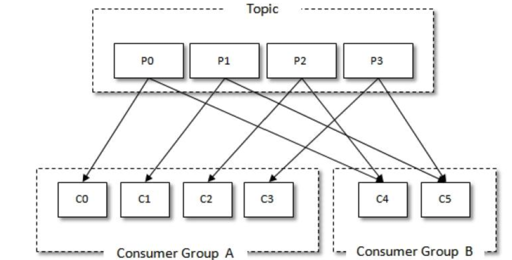
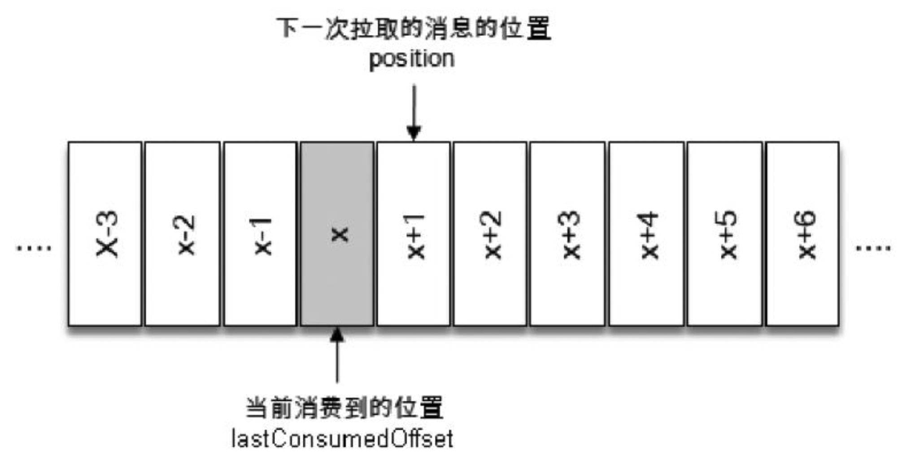
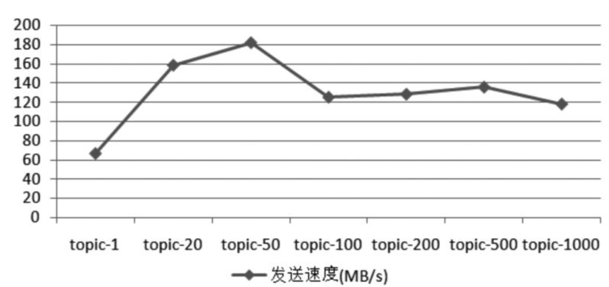

## 1.kafka是什么?

kafka是一个**高吞吐量、低延迟**的消息队列系统，源码采用**java（客户端）和scala（服务端）**来进行编写。

## 2.kafka有哪些优势

1、吞吐量即高；得益于0拷贝和顺序写盘。

>The key fact about disk performance is that the throughput of hard drives has been diverging from the latency of a disk seek for the last decade. As a result the performance of linear writes on a [JBOD](http://en.wikipedia.org/wiki/Non-RAID_drive_architectures) configuration with six 7200rpm SATA RAID-5 array is about **600MB/sec** but the performance of random **writes is only about 100k/sec**—a difference of over 6000X.

2、多分区的机制可以让kafka拥有足够的扩展性。
3、有完整的生态，特别是大数据领域。

4、活跃的社区环境，有利于kafka长期的迭代。

## 3.kafka基本术语

### 3.1 主题（topic）、生产者（producer）和分区（partition）


### 3.2 消费组和消费者



消费组有如下特点

- 一个消费组内可以有1个或者多个消费者。
- 多个消费组之间的消费互不影响。

### 3.3 offset(偏移量)



offset有如下特点

- 每个分区维护一套offset，分区与分区的offset互相隔离。
- 每条消息对应一个offset，并且是唯一的。

### 3.4 消费组

> kafka消费组就是一个组内可以有一个或者多个消费者。而消费组与消费组之间的消费是没有任何关系，两个不同的消费组之间消费互不影响。

假设现在某个主题有4个分区，那么随着消费组内的消费者的变化，消费者订阅分区的策略如下。

#### 3.4.1 消费组只有一个消费者


#### 3.4.2 消费组内有2个消费者


#### 3.4.3 消费者和分区数一样多


#### 3.4.4 组内消费者数量大于分区数量


#### 3.4.5 消费组与消费组之间的关系


## 4.kafka安装

[Kafka官方安装文档](https://kafka.apache.org/quickstart)

> kafka的运行依赖于zookeeper，zookeeper的目的主要是用来管理kafka的一些`元数据`信息；比如：opic/分区的元数据、Broker 数据、ACL（Access Control List 访问控制列表） 信息等等。
>
> 比如安装包`kafka_2.12-3.3.1.tgz`，其中2.12代表的是本安装包是采用2.12版本的scala进行编译的，3.3.1才是kafka的真正版本号。

小提示

> 虽然现在kafka还是依赖于zookeeper，但是从kafka从0.8.2.x开始就在酝酿减少kafka对zookeeper的依赖，因为kafka天然会有大量的读写操作，而zookeeper又天然的不适用于这种高频操作。
>
> 比如原来维护offset都是交给zookeeper来完成的，现在的kafka版本都是有broker来统一维护offset了。

## 5.常用配置文件解释

[服务器配置文件](./file/server.properties)

kafka的broker的参数多达200多个，broker常用的配置文件如下

> log.dirs. 制定日志的位置，可以指定多个，通常设置多个路径挂载在不同的硬盘，这样可以提高读写性能，也能提高容错性。
>
> listeners=PLAINTEXT://192.168.0.213:9092  内外访问kafka
>
> advertised.listeners=PLAINTEXT://101.89.163.1:9092 外网访问kafka
>
> auto.create.topics.enable 是否允许自动创建topic
>
> unclean.leader.election.enable  fasle：只允许从isr中选取leader；true：可以选择非isr中的副本作为leader。

官方的介绍

```
https://kafka.apache.org/documentation/#configuration
```

## 6.kafka的api分类


### 6.1生产者

```java
public void send() {
        Properties props = new Properties();
        // kafka集群地址
        props.put("bootstrap.servers", "localhost:9092");
        // 同步的策略  0[异步发送], 1[同步leader],  all[副本和leader都给同步到]
        // https://betterprogramming.pub/kafka-acks-explained-c0515b3b707e
        props.put("acks", "all");
        // total time between sending a record and receiving acknowledgement from the broker.
        props.put("delivery.timeout.ms", 60000);
  			// 请求超时时间，用来控制重试
        props.put("request.timeout.ms", 30000);
        // The producer maintains buffers of unsent records for each partition.
        props.put("batch.size", 16384);
        // 每毫秒发送一次和batch.size 配合使用
        props.put("linger.ms", 1);
        // 缓存的总内存，当产生的消息比传输的快的时候，这个内存会被快速消耗
        props.put("buffer.memory", 33554432);
        props.put("key.serializer", "org.apache.kafka.common.serialization.StringSerializer");
        props.put("value.serializer", "org.apache.kafka.common.serialization.StringSerializer");

        Producer<String, String> producer = new KafkaProducer<>(props);
        for (int i = 0; i < 5000; i++){
            // producer 的send方法本身就是一个异步的方法，所以想要保证每一条数据都发送成功，
            // 一定要写new Callback 回调方法
            Future<RecordMetadata> future = producer.send(new ProducerRecord<String, String>("foo-1", Integer.toString(i), "messge"), new Callback() {
                @Override
                public void onCompletion(RecordMetadata metadata, Exception e) {
                    if(e != null) {
                        // 如果这个发送异常，数据可以保存到数据库，方便下次再发送
                        e.printStackTrace();
                    } else {
                        System.out.println("The offset of the record we just sent is: " + metadata.offset());
                    }
                }
            });
        }


        producer.close();
    }
```

### 6.2消费者

#### 自动提交

```java
public void consumerAutoCommit() {
        Properties props = new Properties();
        // 设置从哪里消费 earliest[有提交offset，从提交位置，没有从头开始],latest[有提交的offset，从offset消费，等待新消息]
        props.put("auto.offset.reset","earliest");
        props.put("bootstrap.servers", "localhost:9092");
        // 消费组
        props.put("group.id", "test");
        // 开启自动提交
        props.put("enable.auto.commit", "true");
        // 每隔多少ms来提交一次offset
        props.put("auto.commit.interval.ms", "1000");
        // 每次拉取的最大条数 默认为500
        props.put("max.poll.records",500);
        props.put("key.deserializer", "org.apache.kafka.common.serialization.StringDeserializer");
        props.put("value.deserializer", "org.apache.kafka.common.serialization.StringDeserializer");
        KafkaConsumer<String, String> consumer = new KafkaConsumer<>(props);
        // 订阅的topic
        consumer.subscribe(Arrays.asList("foo-1"));
        while (true) {
            // 在100ms内pull数据，如果没有拉取到返回空集合
            ConsumerRecords<String, String> records = consumer.poll(Duration.ofMillis(100));

            for (ConsumerRecord<String, String> record : records){
                try {
                    Thread.sleep(100);
                } catch (InterruptedException e) {
                    throw new RuntimeException(e);
                }
                System.out.printf("offset = %d, key = %s, value = %s%n", record.offset(), record.key(), record.value());
            }
        }
    }
```

> 自动提交的优点：不用进行手动的提交offset，方便进行管理。
>
> 缺点：
>
> 1. 可能会重复消费消息。

#### 手动提交

```java
public void consumerManualCommit() {
        Properties props = new Properties();
        props.put("bootstrap.servers", "localhost:9092");
        props.put("group.id", "test");
        props.put("enable.auto.commit", "false");
        props.put("key.deserializer", "org.apache.kafka.common.serialization.StringDeserializer");
        props.put("value.deserializer", "org.apache.kafka.common.serialization.StringDeserializer");
        KafkaConsumer<String, String> consumer = new KafkaConsumer<>(props);
        consumer.subscribe(Arrays.asList("foo", "bar"));
        final int minBatchSize = 200;
        List<ConsumerRecord<String, String>> buffer = new ArrayList<>();
        while (true) {
            ConsumerRecords<String, String> records = consumer.poll(100);
            for (ConsumerRecord<String, String> record : records) {
                // 比如这里有大量的业务逻辑
                buffer.add(record);
            }
          // 一般认为kafka是一个无限消费的队列，所以没有对records%minBatchSize有余数的数据继续处理
            if (buffer.size() >= minBatchSize) {
                consumer.commitSync();
                buffer.clear();
            }
        }
    }
```

> commitSync手动提交优点：可以人为的控制offset的提交，消费失败则不提交，从而实现精确控制。
>
> commitSync手动提交缺点：
>
> 1. 当提交的时候，consumer阻塞的，从而影响consumer的效率。
> 2. 由于offset完全交给开发者来操作，要注意开发的规范。比如由于先提交了offset再消费数据，从而造成这一批数据中有数据处理逻辑发生异常，而这些数据无法再被消费成功。

#### 关于线程安全问题

> kafka的生产者是线程安全的，但是消费者却是线程不安全的，不建议多线程来进行来对同时对一个consumer来进行消费。
>
> 一般开发中多个消费者的时候建议一个线程对应一个consumer，这样编写代码简单出错了也容易排查。
>
> > 当然特殊情况下，也可以使用多个线程来对consumer来进行消费，因为这样能够加快消费的效率。

## 7.副本机制

### 7.1 kafka副本的特点

一般分布式系统的副本都会有以下的特点

> 1. 提供数据冗余；比如hadoop，elasticsearch。
> 2. 提供高伸缩性；支持横行拓展，能够通过加机器的方式来提高读操作的性能。比如elasticsearch.
> 3. 改善数据局部性。允许将数据放入到距离用户地理位置相近的位置，从而降低系统的延迟。比如spark.

遗憾的是kafka中的副本只能提供`数据冗余`这一个特点。

> 因为kafka的所有的读写操作都是通过一个叫`Leader`的副本来完成的，而其他的kafka的副本是不对外提供服务的，他们只提供数据冗余。

副本的同步机制如下：


只让leader副本来提供数据服务有如下的优势：

> 1. 能够方便用户实时读取到刚才producer生产的数据；比如mysql的主从复制，从节点只用来读数据，那么有可能产生写入数据成功，但是读数据发现没有该数据。
> 2. 方便实现单调读，即不会出现一条数据一会在一会在的情况。比如当前有R1和R2两个副本，其中R1副本已经同步到数据A，但是R2并没有同步到数据A，那么就会出现请求R1副本能够获取数据A而请求R2无法获取数据A。

### 7.2 ISR(In-sync Replicas)

简单来说isr就是`备胎版本的leader的集合`，当然leader副本本身就在这个集合里面。

满足以下条件就会让副本进入到isr集合中

> 1. replica.lag.time.max.ms;默认为10秒，当副本和能够在这个时间内保持和leader的心跳，那么就会被加入到isr中，相反会被从isr中提出去。
> 2. 副本的数据一直在同步leader副本数据，并且同步的数据量满足要求的情况下，那么这个副本就具有了进入isr的资格。

## 8.无消息丢失配置是如何实现的

消息的丢失无非有以下几种情况

> 1. 生产者发送消息了成功了，但是并没有持久化到磁盘中。比如生产者使用异步的发送，而没有采用回调函数来进行检查是否真的发送成功。
> 2. 由于消费者的消费策略或者消费组提交offset方式不合理而造成的消费者没有消费到数据。可比如一个分区从来没有提交过offset，而消费者设置的是latest模式。
> 3. kafka中的数据过期。

### 8.1 使用回调函数来确认producer一定把消息发送到broker中

```java
@Override
public void send() {
        Properties props = new Properties();
        // kafka集群地址
        props.put("bootstrap.servers", "localhost:9092");
        // 同步的策略  0[异步发送], 1[同步leader],  all[副本和leader都给同步到][-1]
        // https://betterprogramming.pub/kafka-acks-explained-c0515b3b707e
        props.put("acks", "all");
        // 发送的超时时间
        props.put("delivery.timeout.ms", 60000);
        props.put("request.timeout.ms", 30000);
        // The producer maintains buffers of unsent records for each partition.
        props.put("batch.size", 16384);
        // 每毫秒发送一次和batch.size 配合使用
        props.put("linger.ms", 1);
        // 缓存的总内存，当产生的消息比传输的快的时候，这个内存会被快速消耗
        props.put("buffer.memory", 33554432);
        props.put("key.serializer", "org.apache.kafka.common.serialization.StringSerializer");
        props.put("value.serializer", "org.apache.kafka.common.serialization.StringSerializer");

        Producer<String, String> producer = new KafkaProducer<>(props);
        for (int i = 0; i < 5000; i++){
        Future<RecordMetadata> future = producer.send(new ProducerRecord<String, String>("foo-1", Integer.toString(i), "message"),
        // 使用回调函数来判断数据是否真的发送成功了
        new Callback() {
@Override
public void onCompletion(RecordMetadata metadata, Exception exception) {
        System.out.println("发送成功");
        }
        });
        }


        producer.close();
        }
```

### 8.2 consumer端消费异常却offset提交成功

> 比如现在一个topic-a有5个partition，同时有5个consumer来进行消费，并且这5个消费者提交offset的方式为自动提交。
>
> 这个时候比如有一个consumer处理数据异常，而这个时候自动提交的时间已到，从而提交了这一批数据的offset，从而造成"消息丢失"。从表面看起来像消息丢失而已，其实是因为处理消费的策略有问题。
>
> 解决方案：
>
> 在consumer端设置参数enable.auto.commit=fasle;并采用手动提交的方式，确保消费完消息再提交。

### 8.3 主题增加分区

当增加主题的分区后，producer会优先于consumer感知到新增的分区，而这个时候consumer设置的是消费策略是`auto.offset.reset=latest`。这个时候由于consumer感知新增的分区比较慢，就会出现有一部分消息无法消费掉。

> 解决方案：
> 1.针对新增的分区开一个专门的consumer，并设置消费的策略为earlist来进行消费.
> 2.实现一个ConsumerRebalanceListener，重写onPartitionsAssigned方法，每次取offset都从数据库中读取，如果能取到则说是已有分区，否则则是新的分区，则从该分区的offset=0开始消费。

8.4 如果有些数据突然消费不到

> 可以查看kafka中消息的过期时间；kafka消息默认过期时间为7天；
>
> 比如昨天消费数据还是正常的，说明topic里面一定是有数据的；但是今天消费同样的一批数据，发现数据无法被消费到，这个时候很有可能就是昨天的数据到达来规定的过期时间，而失效了。

## 9. Rebalance现象

假设目前某个 Consumer Group 下有两个 Consumer，比如 A 和 B，当第三消费者 C 加入时，Kafka 会触发 Rebalance，并根据默认的分配策略重新为 A、B 和 C 分配分区，如下图所示：


但是rebalance会有一个缺点，即：

> 在rebalance的过程中所有的消费者都会停止工作，直到rebalance完成。
>
> 这就造成如果一个组中有很多consumer(比如几百个)，就会造成rebalance很耗时。

触发rebalance的有三个条件，满足其中任意一个就会发生。

> 1. 分区的数量变化。
> 2. 消费组中的消费者数量发生变化。
> 3. 订阅的主题数发生变化(一个consumer可以订阅多个主题)。
> 4. 由于网络抖动让consumer和broker之间的心跳发生了断裂，这时候consumer会被踢出去。

如何避免尽可能的避免发生rebalance的发生，分区数的改变，和订阅主题数的改变，这里问题我们暂时不做考虑，因为这是由于我们业务需要而发生改变而引起的，我们重点分析是由于consumer端的问题导致的rebalance。

下面是三种方式来进行改善rebalance的情况，请注意只是改善而已....

第一种

> 通过设置consumer端的参数来保证防止由于网络问题，导致心跳断开而造成的consumer被从消费组剔除调。
>
> 设置session.timeout.ms 和 heartbeat.interval.ms的参数，比较推荐的数值为:
>
> - 设置 session.timeout.ms = 6s。
> - 设置 heartbeat.interval.ms = 2s。
>
> 这样设置的目的就是在consumer被判定死之前，至少发送3次心跳。

第二种

> 由于kafka的消费逻辑太长，解决方案如下:
>
> - 设置max.poll.interval.ms长一些，比如处理逻辑需要10分钟，你设置成15分钟。
> - 设置max.poll.records的最大条数小一些，从而造成消费的逻辑短一些。

第三种

> consumer端频繁的发生full GC也会引发，rebalance。
>
> 所以可以检查consumer端是否频繁发生了full GC。

第四种

> 当consumer不指定消费具体哪个分区的时候，才会引发rebalance.所以我们可以让consumer来消费某个分区的数据。
>
> 但是此方案可能会造成某个consumer服务宕机，从而造成某个分区的数据暂时不会被消费掉。

代码如下

```
        KafkaConsumer<String, String> consumer = new KafkaConsumer<>(props);
        // 分区编号从0开始
        TopicPartition partition=new TopicPartition("foo-1",0);
        // 订阅制定partition
        consumer.assign(Arrays.asList(partition));
```

## 10.控制器(Controller)

> 控制器组件（Controller）是kafka的核心组。它的作用是在Zookeeper的帮助下管理和协调整个kafka集群。
>
> 一个kafka集群只会有个broker能够成为控制器。

### 10.1 控制器是如何被选出来的呢？

> Broker启动的时候都会尝试去创建/controller临时节点，谁优先创建成功，哪个broker就是controller节点。

### 10.2 控制器的作用

1. 主题的管理；创建、删除、增加分区。
2. 分区重分配；比如新加的一个broker节点，由于kafka不会实现副本数据的迁移，所以可以使用重分区来实现。
3. 集群broker成员的管理，包括broker的新增，broker关闭，broker宕机。
4. 维护kafka元数据；比如副本信息元数据，分区数据元数据，当前broker存活列表等等。

### 10.3 kafka在zookeeper创建的节点


## 11. kafka和其他消息队列的对比优劣

### 11.1 kafka优势

> 1. 采用顺序写盘和0拷贝等技术实现高速写盘。
> 2. kafka类似一个数据的日志文件，你可以无限制的反复消费，而有些mq，比如activemq消费完就会把该数据从磁盘上移除掉。
> 3. 可以实现海量数据的堆积，这也是为何日志收集会首选kafka的原因。
> 4. 生产和消费的最小单位为partition，可以通过增加partition的数量来增加系统的吞吐量。

### 11.2 kafka劣势

> 1. 相比于其他消费队列其本身偏重，比较消化资源，特别是内存。
> 2. 缺失一些特性，比如事务的特性（kafka也确实有事务，但是他的事务是发送数据要不都成功，要么都失败，而不是业务上的事务）。

## 12. 关于kafka和rocketmq对比的一些错误言论

甚至有些阿里官方描述kafka和rocketmq的对比也是有待商榷

```
https://alibaba-cloud.medium.com/kafka-vs-rocketmq-multiple-topic-stress-test-results-d27b8cbb360f
```

《深入理解Kafka核心设计与实践原理》的测试数据如下：

发送100w每条消息的大小为1kb;并且环境配置如下：

> 1. 发送的参数设置为acks=1
> 2. 使用3台普通云主机配置分别为：内存8G，磁盘40Gb，4核主频为2600Mhz
> 3. jvm版本为1.8.0-112,linux系统版本为2.6.32-504.23.4.el6.x86_64



消费者消费完100w条数据的性能如下：


其他一些关于kafka介绍的很多都是错误的文章

```
https://zhuanlan.zhihu.com/p/60196818
https://blog.csdn.net/shijinghan1126/article/details/104724407
```

## 13. 未来kafka的发展

kakfa在未来会取消zookeeper而采用KRaft

```aidl
https://www.infoq.com/news/2022/10/apache-kafka-kraft/
```


