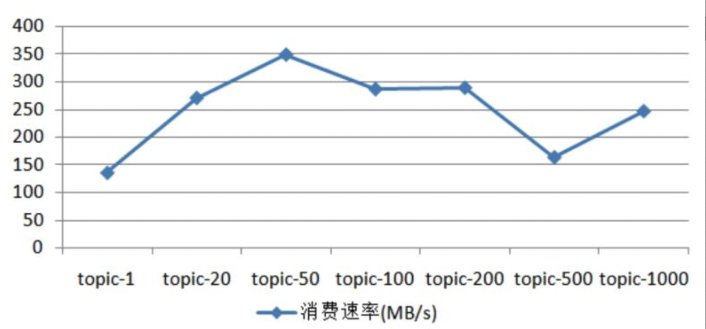

## kafka是什么

kafka是一个**高吞吐量、低延迟**的消息队列系统，源码采用**java（客户端）和scala（服务端）**来进行编写。

比如比如安装包`kafka_2.12-3.3.1.tgz`，其中2.12代表的是本安装包是采用2.12版本的scala进行编译的，3.3.1才是kafka的真正版本号。

## 为何选择kafka

1、吞吐量即高；得益于0拷贝和顺序写盘。

>The key fact about disk performance is that the throughput of hard drives has been diverging from the latency of a disk seek for the last decade. As a result the performance of linear writes on a [JBOD](http://en.wikipedia.org/wiki/Non-RAID_drive_architectures) configuration with six 7200rpm SATA RAID-5 array is about **600MB/sec** but the performance of random **writes is only about 100k/sec**—a difference of over 6000X.

2、多分区的机制可以让kafka拥有足够的扩展性。
3、有完整的生态，特别是大数据领域。

4、活跃的社区环境，有利于kafka长期的迭代。

## kafka基本术语

**主题（topic）、生产者（producer）和分区（partition）**


**消费组和消费者**


消费组有如下特点

- 一个消费组内可以有1个或者多个消费者。
- 多个消费组之间的消费互不影响。

**offset(偏移量)**


offset有如下特点

- 每个分区维护一套offset，分区与分区的offset互相隔离。
- 每条消息对应一个offset，并且是唯一的。

## 1.kafka安装

[Kafka官方安装文档](https://kafka.apache.org/quickstart)

> kafka的运行依赖于zookeeper，zookeeper的目的主要是用来管理kafka的一些`元数据`信息；比如：opic/分区的元数据、Broker 数据、ACL（Access Control List 访问控制列表） 信息等等。

但是kafka从0.8.2.x开始就在酝酿减少kafka对zookeeper的依赖，因为kafka天然会有大量的读写操作，而zookeeper又天然的不适用于这种高频操作。

## 3.常用配置文件解释

[服务器配置文件](./file/server.properties)

kafka的broker的参数多达200多个，broker常用的配置文件如下

> log.dirs. 制定日志的位置，可以指定多个，通常设置多个路径挂载在不同的硬盘，这样可以提高读写性能，也能提高容错性。
>
> listeners=PLAINTEXT://192.168.0.213:9092  内外访问kafka
>
> advertised.listeners=PLAINTEXT://101.89.163.1:9092 外网访问kafka
>
> auto.create.topics.enable 是否允许自动创建topic
>
> unclean.leader.election.enable  fasle：只允许从isr中选取leader；true：可以选择非isr中的副本作为leader。

官方的介绍

```
https://kafka.apache.org/documentation/#configuration
```

## 4.kafka的api分类

``

## 代码的基本编写

**生产者**

```java
public void send() {
        Properties props = new Properties();
        // kafka集群地址
        props.put("bootstrap.servers", "localhost:9092");
        // 同步的策略  0[异步发送], 1[同步leader],  all[副本和leader都给同步到]
        // https://betterprogramming.pub/kafka-acks-explained-c0515b3b707e
        props.put("acks", "all");
        // 发送的超时时间
        props.put("delivery.timeout.ms", 60000);
        props.put("request.timeout.ms", 30000);
        // The producer maintains buffers of unsent records for each partition.
        props.put("batch.size", 16384);
        // 每毫秒发送一次和batch.size 配合使用
        props.put("linger.ms", 1);
        // 缓存的总内存，当产生的消息比传输的快的时候，这个内存会被快速消耗
        props.put("buffer.memory", 33554432);
        props.put("key.serializer", "org.apache.kafka.common.serialization.StringSerializer");
        props.put("value.serializer", "org.apache.kafka.common.serialization.StringSerializer");

        Producer<String, String> producer = new KafkaProducer<>(props);
        for (int i = 0; i < 5000; i++){
            // producer 的send方法本身就是一个异步的方法，所以想要保证每一条数据都发送成功，
            // 一定要写new Callback 回调方法
            Future<RecordMetadata> future = producer.send(new ProducerRecord<String, String>("foo-1", Integer.toString(i), "messge"), new Callback() {
                @Override
                public void onCompletion(RecordMetadata metadata, Exception e) {
                    if(e != null) {
                        // 如果这个发送异常，数据可以保存到数据库，方便下次再发送
                        e.printStackTrace();
                    } else {
                        System.out.println("The offset of the record we just sent is: " + metadata.offset());
                    }
                }
            });
        }


        producer.close();
    }
```

**消费者**

自动提交

```java
public void consumerAutoCommit() {
        Properties props = new Properties();
        // 设置从哪里消费 earliest[有提交offset，从提交位置，没有从头开始],latest[有提交的offset，从offset消费，等待新消息]
        props.put("auto.offset.reset","earliest");
        props.put("bootstrap.servers", "localhost:9092");
        // 消费组
        props.put("group.id", "test");
        // 开启自动提交
        props.put("enable.auto.commit", "true");
        // 每隔多少ms来提交一次offset
        props.put("auto.commit.interval.ms", "1000");
        // 每次拉取的最大条数 默认为500
        props.put("max.poll.records",500);
        props.put("key.deserializer", "org.apache.kafka.common.serialization.StringDeserializer");
        props.put("value.deserializer", "org.apache.kafka.common.serialization.StringDeserializer");
        KafkaConsumer<String, String> consumer = new KafkaConsumer<>(props);
        // 订阅的topic
        consumer.subscribe(Arrays.asList("foo-1"));
        while (true) {
            // 在100ms内pull数据，如果没有拉取到返回空集合
            ConsumerRecords<String, String> records = consumer.poll(Duration.ofMillis(100));

            for (ConsumerRecord<String, String> record : records){
                try {
                    Thread.sleep(100);
                } catch (InterruptedException e) {
                    throw new RuntimeException(e);
                }
                System.out.printf("offset = %d, key = %s, value = %s%n", record.offset(), record.key(), record.value());
            }
        }
    }
```

> 自动提交的优点：不用进行手动的提交offset，方便进行管理。
>
> 缺点：
>
> 1. 可能会重复消费消息。
> 2. 比如你处理逻辑比较长，这期间自动提交offset已经完成，但是这个时候消费者发送异常了，那么这就可能造成部分数据没有被消费掉而产生"数据丢失"的错觉。

手动提交

```java
public void consumerManualCommit() {
        Properties props = new Properties();
        props.put("bootstrap.servers", "localhost:9092");
        props.put("group.id", "test");
        props.put("enable.auto.commit", "false");
        props.put("key.deserializer", "org.apache.kafka.common.serialization.StringDeserializer");
        props.put("value.deserializer", "org.apache.kafka.common.serialization.StringDeserializer");
        KafkaConsumer<String, String> consumer = new KafkaConsumer<>(props);
        consumer.subscribe(Arrays.asList("foo", "bar"));
        final int minBatchSize = 200;
        List<ConsumerRecord<String, String>> buffer = new ArrayList<>();
        while (true) {
            ConsumerRecords<String, String> records = consumer.poll(100);
            for (ConsumerRecord<String, String> record : records) {
                // 比如这里有大量的业务逻辑
                buffer.add(record);
            }
            if (buffer.size() >= minBatchSize) {
                consumer.commitSync();
                buffer.clear();
            }
        }
    }
```

> commitSync手动提交优点：可以人为的控制offset的提交，消费失败则不提交。
>
> commitSync手动提交缺点：当提交的时候，consumer阻塞的，从而影响consumer的效率。


> 需要注意的是，kafka的生产者是线程安全的，但是消费者却是线程不安全的，不建议多线程来进行来对同时对一个或者多个consumer来进行共同的操作。
>
> 一般开发中都适用一个线程对应一个消费者。


## 5.常见报错

5.1  delivery.timeout.ms should be equal to or larger than linger.ms + request.timeout.ms

解决方案

```
设置 delivery.timeout.ms 大于  request.timeout.ms
```

5.2 队列有时候能消费到数据，有时候不能[kafka的topic中有大量的数据]

```
kafka有过期时间，一旦超过这个过期时间，consumer是不能消费到这些数据的，即使这些数据还没有被删除[过期不意味着立马删除]
```

5.3 手动提交处理异常不当，造成的重复消费，从而造成逻辑错误

```
根据业务需要，把错误信息记录起来，把错误进行try catch，保证consumer能够正常提价offset
```

5.4 三种传递语义可能引发的问题

```
https://blog.csdn.net/wangxueying5172/article/details/122506420?utm_medium=distribute.pc_relevant.none-task-blog-2~default~baidujs_baidulandingword~default-0-122506420-blog-119881907.pc_relevant_recovery_v2&spm=1001.2101.3001.4242.1&utm_relevant_index=3
```


## 6.题外闲谈

6.1版本号

```
Scala 2.12  - kafka_2.12-3.3.1.tgz (asc, sha512)
Scala 2.13  - kafka_2.13-3.3.1.tgz (asc, sha512)
```

6.2 kafka部署再windows和linux上有区别吗？

```
1. Kafka 客户端底层使用了 Java 的 selector，selector 在 Linux 上的实现机制是 epoll，而在 Windows 平台上的实现机制是 select。因此在这一点上将 Kafka 部署在 Linux 上是有优势的，因为能够获得更高效的 I/O 性能。
通常情况下认为epoll比select更加的高级。
2.零拷贝（Zero Copy）技术，就是当数据在磁盘和网络进行传输时避免昂贵的内核态数据拷贝从而实现快速的数据传输。
3.windows版本的kafka的bug修复慢，windows上练习下kafka即可。
```

## 7.kafka和其他消息系统的区别

```
Kafka works well as a replacement for a more traditional message broker. Message brokers are used for a variety of reasons (to decouple processing from data producers, to buffer unprocessed messages, etc). In comparison to most messaging systems Kafka has better throughput, built-in partitioning, replication, and fault-tolerance which makes it a good solution for large scale message processing applications.

In our experience messaging uses are often comparatively low-throughput, but may require low end-to-end latency and often depend on the strong durability guarantees Kafka provides.

In this domain Kafka is comparable to traditional messaging systems such as ActiveMQ or RabbitMQ.
```

kafka和rocketmq的区别

```
https://rocketmq.apache.org/docs/
```

1. 全局的消息一致性
2. 事务比较完善


kafka三种语义方式

- at-least-once
- at most once
- exactly once

使用springboot的kafka常见的坑

## 8.无消息丢失配置是如何实现的

1.使用回调函数来确认producer一定把消息发送到broker中

```java
@Override
public void send() {
        Properties props = new Properties();
        // kafka集群地址
        props.put("bootstrap.servers", "localhost:9092");
        // 同步的策略  0[异步发送], 1[同步leader],  all[副本和leader都给同步到][-1]
        // https://betterprogramming.pub/kafka-acks-explained-c0515b3b707e
        props.put("acks", "all");
        // 发送的超时时间
        props.put("delivery.timeout.ms", 60000);
        props.put("request.timeout.ms", 30000);
        // The producer maintains buffers of unsent records for each partition.
        props.put("batch.size", 16384);
        // 每毫秒发送一次和batch.size 配合使用
        props.put("linger.ms", 1);
        // 缓存的总内存，当产生的消息比传输的快的时候，这个内存会被快速消耗
        props.put("buffer.memory", 33554432);
        props.put("key.serializer", "org.apache.kafka.common.serialization.StringSerializer");
        props.put("value.serializer", "org.apache.kafka.common.serialization.StringSerializer");

        Producer<String, String> producer = new KafkaProducer<>(props);
        for (int i = 0; i < 5000; i++){
        Future<RecordMetadata> future = producer.send(new ProducerRecord<String, String>("foo-1", Integer.toString(i), "message"),
        // 使用回调函数来判断数据是否真的发送成功了
        new Callback() {
@Override
public void onCompletion(RecordMetadata metadata, Exception exception) {
        System.out.println("发送成功");
        }
        });
        }


        producer.close();
        }
```

2.consumer端消费失败缺offset提交成功

> 比如现在一个topic-a有5个partition，同时有5个consumer来进行消费，并且这5个消费者提交offset的方式为自动提交。
>
> 这个时候比如有一个consumer处理数据异常，但是由于是自动提交，从而造成"消息丢失"。从表面看起来像消息丢失而已，其实是因为消费不成功。
>
> 解决方案：
>
> 在consumer端设置参数enable.auto.commit=fasle;并采用手动提交的方式，确保消费完消息再提交。

3.增加主题的分区后。当增加主题的分区后，producer会优先于consumer感知到新增的分区，而consumer设置的是消费策略是`auto.offset.reset=latest`。这个时候由于consumer感知新增的分区比较慢，就会出现有一部分消息无法消费掉。

```
解决方案：
1.针对新增的分区开一个专门的consumer，并设置消费的策略为earlist来进行消费.
2.实现一个ConsumerRebalanceListener，重写onPartitionsAssigned方法，每次取offset都从数据库中读取，如果能取到则说是已有分区，否则则是新的分区，则从该分区的offset=0开始消费。
```

## 8.关于kafka producer的三种语义

1. 最多一次（at most once）：消息可能会丢失，但绝不会被**重复发送。**
2. 至少一次（at least once）：消息不会丢失，但有可能被**重复发送。**
3. 精确一次（exactly once）：消息不会丢失，也不会被**重复发送。**

kafka默认采用的第2种方式，即可能造成数据重发，但是不会丢失。


kafka多线程消费

```
https://www.cnblogs.com/huxi2b/p/7089854.html
```

## 9.消费组


消费组内存在rebalance的情况。

假设目前某个 Consumer Group 下有两个 Consumer，比如 A 和 B，当第三个成员 C 加入时，Kafka 会触发 Rebalance，并根据默认的分配策略重新为 A、B 和 C 分配分区，如下图所示：


但是rebalance会有一个缺点，即：

> 在rebalance的过程中所有的消费者都会停止工作，直到rebalance完成。
>
> 这就造成如果一个组中有很多consumer(比如几百个)，就会造成rebalance很耗时。

触发rebalance的有三个条件，满足其中任意一个就会发生。

> 1. 分区的数量变化。
> 2. 消费组中的消费者数量发生变化。
> 3. 订阅的主题数发生变化(一个consumer可以订阅多个主题)。
> 4. 由于网络抖动让consumer和broker之间的心跳发生了断裂，这时候consumer会被踢出去。

如何避免尽可能的避免发生rebalance的发生，分区数的改变，和订阅主题数的改变，这里问题我们暂时不做考虑，因为这是由于我们业务需要而发生改变而引起的，我们重点分析是由于consumer端的问题导致的rebalance。

下面是三种方式来进行改善rebalance的情况，请注意只是改善而已....

第一种

> 通过设置consumer端的参数来保证防止由于网络问题，导致心跳断开而造成的consumer被从消费组剔除调。
>
> 设置session.timeout.ms 和 heartbeat.interval.ms的参数，比较推荐的数值为:
>
> - 设置 session.timeout.ms = 6s。
> - 设置 heartbeat.interval.ms = 2s。
>
> 这样设置的目的就是在consumer被判定死之前，至少发送3次心跳。

第二种

> 由于kafka的消费逻辑太长，解决方案如下:
>
> - 设置max.poll.interval.ms长一些，比如处理逻辑需要10分钟，你设置成15分钟。
> - 设置max.poll.records的最大条数小一些，从而造成消费的逻辑短一些。

第三种

> consumer端频繁的发生full GC也会引发，rebalance。
>
> 所以可以检查consumer端是否频繁发生了full GC。

第四种

> 当consumer不指定消费具体哪个分区的时候，才会引发rebalance.所以我们可以让consumer来消费某个分区的数据。
>
> 但是此方案可能会造成某个consumer服务宕机，从而造成某个分区的数据暂时不会被消费掉。

代码如下

```
        KafkaConsumer<String, String> consumer = new KafkaConsumer<>(props);
        // 分区编号从0开始
        TopicPartition partition=new TopicPartition("foo-1",0);
        // 订阅制定partition
        consumer.assign(Arrays.asList(partition));
```


kafka和rocketmq的对比

```
https://alibaba-cloud.medium.com/kafka-vs-rocketmq-multiple-topic-stress-test-results-d27b8cbb360f
```

《深入理解Kafka核心设计与实践原理》的测试数据如下：

发送100w每条消息的大小为1kb;并且环境配置如下：

> 1. 发送的参数设置为acks=1
> 2. 使用3台普通云主机配置分别为：内存8G，磁盘40Gb，4核主频为2600Mhz
> 3. jvm版本为1.8.0-112,linux系统版本为2.6.32-504.23.4.el6.x86_64


消费者消费完100w条数据的性能如下：




关于kakfa在未来取消zookeeper而采用KRaft
```aidl
https://www.infoq.com/news/2022/10/apache-kafka-kraft/
```

acks的解释
```
https://betterprogramming.pub/kafka-acks-explained-c0515b3b707e
```

参考资料

```
https://blog.51cto.com/u_15287666/3105825#21_broker_14
```

疑问

1. 如果消费者的自动提交时间特别长，而拉去的数据特别少，比如1条，那么消费完这一条数据，consumer还会继续消费吗？


